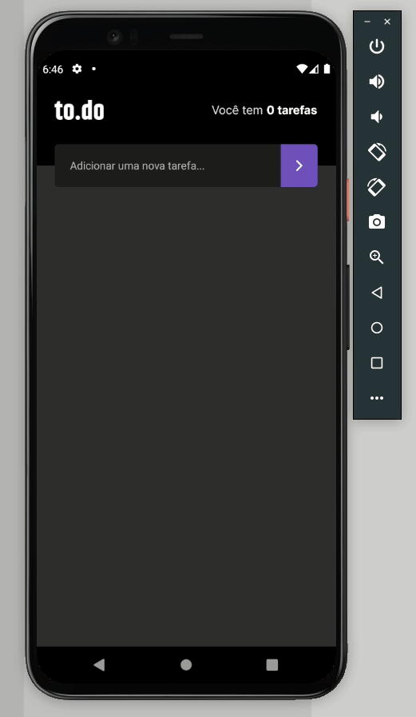

# To-do Personalizado 

## Funcionalidades do App

1. Contagem de tarefas.
2. Criar, editar e remover uma tarefa.
3. Marcar e desmarcar uma tarefa como concluída.
4. Exibição de alertas para as seguintes situações: 
* tentar adicionar uma tarefa em branco;
* tentar adicionar uma tarefa com o mesmo nome;
* Pedir confirmação para remover uma tarefa;nome;

## Tecnologias:
 

 
 
 
<h1 align="center">
  
</h1>